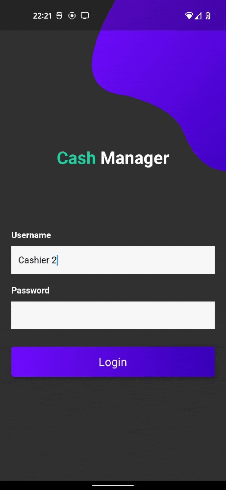

<h1 align="center">
    Cash Manager
</h1>

Cash Manager is a mobile app that replicates how automated pay stations work. The supermarket's owner registers its products on it and customers can pay for the ones they choose by NFC payment after scanning their barcodes.

<p align="center">
    
</p>

## Build with
* [Java Spring (Kotlin)](https://spring.io/)
* [Flutter](https://flutter.dev/)

## How to test
- lauch docker-compose
- Add a product line 86 in data.sql with a physical product around you. The first item is his barcode number.
- Login as Admin (username: admin, password: admin)
- Register a product by scanning it
- Logout
- Login as User (username: user, password: user)
- Scan products that your have added in db as admin
- Pay with NFC

## How to Run if docker-compose up is not working

- Start a postgres container :
```
docker run --name postgres -e POSTGRES_PASSWORD=postgres -p 5432:5432 -d --rm postgres 
```
- Create application.properties in /cashmanager/src/main/resources/ and link it to postgres container 
```
cd cashmanager && mvn install
```
```
 mvn spring-boot:run --debug
```
- Create .env in /front -> http://10.0.2.2:8080 for Android studio
```
flutter clean && flutter clean && flutter run
```

- Link api port for real device with Android studio \
update .env to http:localhost:8080 and
```
adb reverse tcp:8080 tcp:8080
```

